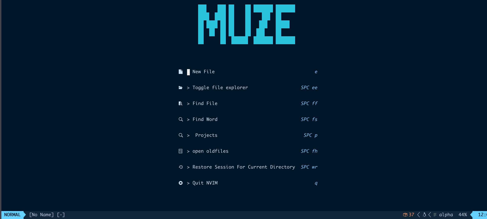
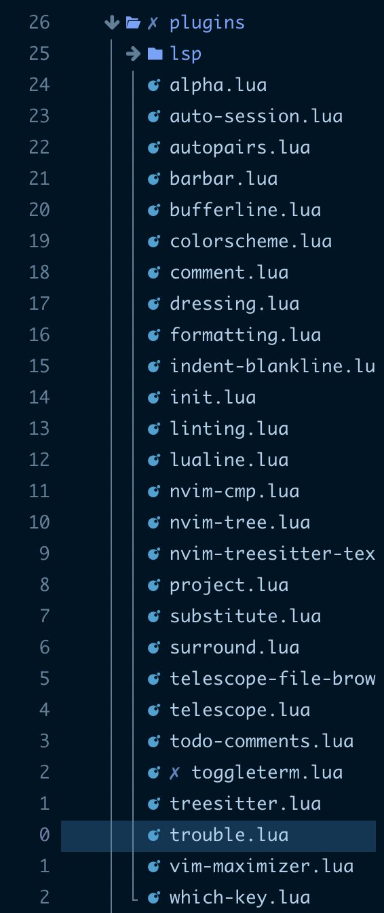

# My Neovim Config Files 🚀

[English](README.md) | [中文](README.zh.md)

**Important**: This is my latest config with lazy.nvim. Don’t blindly use my settings unless you know what that entails. Use at your own risk!




# How to use

## https

```bash
git clone https://github.com/terry-ice/Neovim.git ~/.config nvim
```

## SSH

```bash
git clone  git@github.com:terry-ice/Neovim.git ~/.config nvim
```

# Setup Requires

- True Color Terminal Like: [iTerm2](https://iterm2.com/)
- [Neovim](https://neovim.io/) (Version 10 )
- [Nerd Font](https://www.nerdfonts.com/) - I use Meslo Nerd Font
- If working with typescript/javascript and the typescript language server like me. You might need to install node/npm.

## Node/Npm:

```bash
brew install node
```

## iTerm2:

```bash
brew install --cask iterm2
```

## Nerd font:

```bash
brew tap homebrew/cask-fonts
brew install font-meslo-lg-nerd-font
```

## Neovim:

```bash
brew install neovim
```

# Some Plugins list

- lazy.nvim [folke/lazy.nvim](https://github.com/folke/lazy.nvim) - Amazing plugin manager
- alpha [gaoolord/alpha-nvim](https://github.com/gaoolord/alpha-nvim) [head-setting](https://patorjk.com/software/taag/#p=display&h=2&v=0&f=ANSI%20Shadow&t=muze)
- [nvim-lua/plenary](https://github.com/nvim-lua/plenary.nvim) - Useful lua functions other plugins use
- [folke/tokyonight.nvim](https://github.com/folke/tokyonight.nvim) - tokyonight colorscheme (I modified some colors it in config)
- [christoomey/vim-tmux-navigator](https://github.com/christoomey/vim-tmux-navigator) - navigate b/w nvim splits & tmux panes with CTRL+h,j,k,l
- [kylechui/nvim-surround](https://github.com/kylechui/nvim-surround) - manipulate surroundings with "ys", "ds", and "cs"
- [gbprod/substitute.nvim](https://github.com/gbprod/substitute.nvim) - replace things with register with "s" and "S"
- [nvim-tree/nvim-tree.lua](https://github.com/nvim-tree/nvim-tree.lua)
- [kyazdani42/nvim-web-devicons](https://github.com/kyazdani42/nvim-web-devicons)
- [goolord/alpha-nvim](https://github.com/goolord/alpha-nvim) -- neovim greeter on startup
- [rmagatti/auto-session](https://github.com/rmagatti/auto-session) - auto save neovim sessions/restore with keymap
- [nvim-lualine/lualine.nvim](https://github.com/nvim-lualine/lualine.nvim) - Better statusline
- [akinsho/bufferline.nvim](https://github.com/akinsho/bufferline.nvim) - Better looking tabs
- [folke/which-key.nvim](https://github.com/folke/which-key.nvim) - Get suggested keymaps as you type
- [nvim-telescope/telescope-fzf-native.nvim](https://github.com/nvim-telescope/telescope-fzf-native.nvim) - Dependency for better performance
- [nvim-telescope/telescope.nvim](https://github.com/nvim-telescope/telescope.nvim) - Fuzzy Finder
- [stevearc/dressing.nvim](https://github.com/stevearc/dressing.nvim) - select/input ui improvement
- [hrsh7th/nvim-cmp](https://github.com/hrsh7th/nvim-cmp) - Completion plugin
- [hrsh7th/cmp-buffer](https://github.com/hrsh7th/cmp-buffer) - Completion source for text in current buffer
- [hrsh7th/cmp-path](https://github.com/hrsh7th/cmp-path) - Completion source for file system paths
- [onsails/lspkind.nvim](https://github.com/onsails/lspkind.nvim) - Vs Code Like Icons for autocompletion
- [L3MON4D3/LuaSnip](https://github.com/L3MON4D3/LuaSnip) - Snippet engine
- [rafamadriz/friendly-snippets](https://github.com/rafamadriz/friendly-snippets) - Useful snippets for different languages
- [saadparwaiz1/cmp_luasnip](https://github.com/saadparwaiz1/cmp_luasnip) - Completion source for snippet autocomplete
- [williamboman/mason.nvim](https://github.com/williamboman/mason.nvim) - Install language servers, formatters and linters
- [williamboman/mason-lspconfig.nvim](https://github.com/williamboman/mason-lspconfig.nvim) - Bridges gap b/w mason & lspconfig
- [neovim/nvim-lspconfig](https://github.com/neovim/nvim-lspconfig) - Easy way to configure lsp servers
- [hrsh7th/cmp-nvim-lsp](https://github.com/hrsh7th/cmp-nvim-lsp) - Smart code autocompletion with lsp
- [folke/trouble.nvim](https://github.com/folke/trouble.nvim) - nice way to see diagnostics and other stuff
- [stevearc/conform.nvim](https://github.com/stevearc/conform.nvim) - Easy way to configure formatters
- [mfussenegger/nvim-lint](https://github.com/mfussenegger/nvim-lint) - Easy way to configure linters
- [WhoIsSethDaniel/mason-tool-installer.nvim](https://github.com/WhoIsSethDaniel/mason-tool-installer.nvim) - Auto install linters & formatters on startup
- [numToStr/Comment.nvim](https://github.com/numToStr/Comment.nvim) - toggle comments with "gc"
- [JoosepAlviste/nvim-ts-context-commentstring](https://github.com/JoosepAlviste/nvim-ts-context-commentstring) - Requires treesitter
- [folke/todo-comments.nvim](https://github.com/folke/todo-comments.nvim) - highlight/search for comments like todo/hack/bug
- [nvim-treesitter/nvim-treesitter](https://github.com/nvim-treesitter/nvim-treesitter) - Treesitter configuration
- [nvim-treesitter/nvim-treesitter-textobjects](https://github.com/nvim-treesitter/nvim-treesitter-textobjects) - Treesitter configuration
- [windwp/nvim-autopairs](https://github.com/windwp/nvim-autopairs) - Autoclose brackets, parens, quotes, etc...
- [windwp/nvim-ts-autotag](https://github.com/windwp/nvim-ts-autotag) - Autoclose tags
- [lukas-reineke/indent-blankline.nvim](https://github.com/lukas-reineke/indent-blankline.nvim) - Indent guides with treesitter integration
- [lewis6991/gitsigns.nvim](https://github.com/lewis6991/gitsigns.nvim) - Show modifications on left hand side and interact with git hunks
- [kdheepak/lazygit.nvim](https://github.com/kdheepak/lazygit.nvim) - Use lazygit within Neovim
